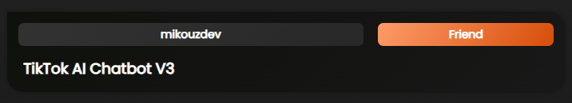

# TikTok AI Chatbot V3

A React application that integrates with TikTok live sessions, allowing viewers to interact with an AI chatbot during the live stream. The chatbot responds to comments using OpenAI's ChatGPT and Text-to-Speech API.

## Features

- Real-time interaction with an AI chatbot during a TikTok live session.
- Text-to-Speech capability for audible responses.
- Comment queue system that allows deleting of queued comments. (Route: `/moderation`)

## Usage with Docker
1. Clone the repository  
2. run `docker compose up` or `docker compose up --build`

## Configuration

1. Rename `.env.template` to `.env` in the root directory.
2. Set up the required environment variables in the `.env` file.

